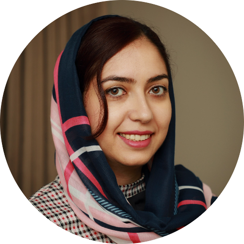
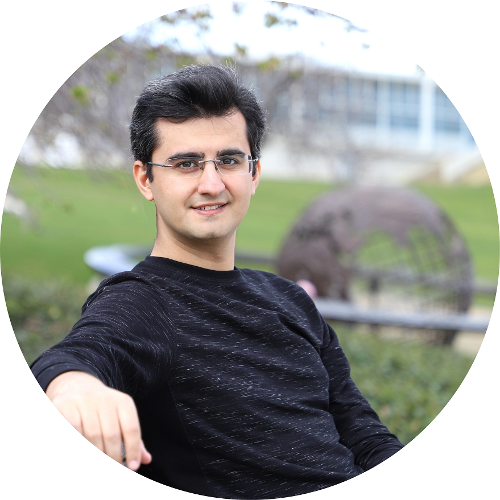
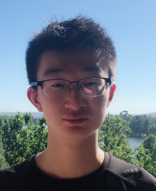

<link rel="stylesheet" type="text/css" href="css/bootstrap.min.css">
<link rel="stylesheet" type="text/css" href="css/main.css?1" media="screen,projection">

## Computer Vision Reading Groups and Tutorials, ANU-CVML
---

The CVRG and Tutorial meets weekly to discuss (mostly) recent papers in computer vision and related topics. There are also tutorial sessions, aim to introduce fundamental topics in computer vision in two/three consecutive sessions. For the reading groups, all participants are encouraged read the papers before the meeting since the presenter will only be giving an overview (15-20 minutes). The remaining time will be dedicated to the discussion of the paper, led by the presenter. For tutorials, the lecturer(s) will walk you through the main concepts, theory, and applications of the topic that will be presented.

---

### Tutorial 1: Deep Generative Models
This tutorial covers an introduction to generative models, deep autoregressive models, variational autoencoders, normalizing flows, generative adversarial networks, and energy-based models. This is a three-session tutorial provided by Fatemeh Saleh, Sadegh Aliakbarian, and Xin Yu.

  

    
    

      <a href="https://fatemeh-slh.github.io/" target="_blank">Fatemeh Saleh</a> 
        Session 1: Introduction to Generative Models, Deep Autoregressive Models 
      <button class="button button4"><a href="https://drive.google.com/file/d/1UR6SicwRVpJNulR8HjeB4MzocyJ0_q8O/view?usp=sharing">Slides</a></button>
      <button class="button button4"><a href="https://drive.google.com/file/d/1Iw-7Sjx4jgEh4BTo0imZr3kmcZvpx8Fp/view?usp=sharing">Video</a></button>
    

   

   
   

    
    

      <a href="https://sadegh-aa.github.io/" target="_blank">Sadegh Aliakbarian</a> 
      Session 2: Variational Autoencoders, Normalizing Flows 
      <button class="button button4"><a href="https://drive.google.com/file/d/1Z-qGr2h4qzeOjBhC8RpC73AcZ2QsD65I/view?usp=sharing">Slides</a></button>
      <button class="button button4"><a href="https://drive.google.com/file/d/1fHNyGIHI1eJU95nhf7SEzq4OCxyMc_5_/view?usp=sharing">Video</a></button>
    

  

  
  

    
    

      <a href="https://sites.google.com/view/xinyus-homepage/Home" target="_blank">Xin Yu</a> 
      Session 3: Generative Adversarial Networks, Energy-based Models 
      <button class="button button4"><a href="https://drive.google.com/file/d/1V4yYaO4b6vUrtRUfNi2OPAWHemCPaJdh/view?usp=sharing">Slides</a></button>
      <button class="button button4"><a href="https://drive.google.com/drive/folders/1hh640IG5lMBdFkA9Is2qqrxHxZ3PSFCh?usp=sharing">Video</a></button>
    

  

---

### Tutorial 2: 3D Vision
This tutorial covers the important concepts in 3D vision including dense matching, photometric 3D reconstruction, and an overview of deep learning on 3D point clouds. This is a four-session tutorial provided by Yiran Zhong, Ziang Cheng, and Itzik Ben-Shabat.

  

    
    

      <a href="https://www.roboticvision.org/rv_person/yiran-zhong/" target="_blank">Yiran Zhong</a> 
        Session 1,2: An overview of deep learning on dense matching 
      <button class="button button4"><a href="https://drive.google.com/file/d/14L7-NogJZJUY_knr8QWCz1NQnYoke_nm/view?usp=sharing">Slides</a></button>
      <button class="button button4"><a href="https://drive.google.com/drive/folders/1vuGmoljrAeMqaruLjOyb_G-f__42nDZm?usp=sharing">Video</a></button>
    

   

   
   

    
    

      <a href="https://www.roboticvision.org/rv_person/ziang-cheng/" target="_blank">Ziang Cheng</a> 
      Session 3: An overview of photometric 3D reconstruction 
      <button class="button button4"><a href="https://drive.google.com/file/d/1Zv91KhEtolceQRRwNi666dA20En_7Uv7/view?usp=sharing">Slides</a></button>
      <button class="button button4"><a href="https://drive.google.com/file/d/1JLjaJwjekIuRJBg1JcxiRfSf-gR4yP_i/view?usp=sharing">Video</a></button>
    

  

  
  

    
    

      <a href="http://www.itzikbs.com/" target="_blank">Itzik Ben-Shabat</a> 
      Session 4: An overview of deep learning on 3D point clouds 
      <button class="button button4"><a href="https://drive.google.com/file/d/1fY-2VOGyOfMF_wD9zI-lGODpDBOzOfZy/view?usp=sharing">Slides</a></button>
      <button class="button button4"><a href="https://drive.google.com/file/d/1zwqMMgYaSbmZBfTeMfyz0ip1f3V_ma2-/view?usp=sharing">Video</a></button>
    

  

---

### Tutorial 3: Reinforcement Learning
In this tutorial we will cover the general setup and basic ideas of reinforcement learning. This is a two-session tutorial provided by Chamin Hewa Koneputugodage and Jaskirat Singh.

  

    
    

      <a href="https://www.roboticvision.org/rv_person/chamin-hewa-koneputugodage/" target="_blank">Chamin Hewa Koneputugodage</a> 
        Session 1: Introduction to Reinforcement Learning  
      <button class="button button4"><a href="https://drive.google.com/file/d/1MDwjv90k5YBnpFUo77exuQHUqcOgY8Wo/view?usp=sharing">Slides</a></button>
      <button class="button button4"><a href="https://drive.google.com/file/d/1LsyAvWvutl7BpHbZGlxJieHhvpQGug8A/view?usp=sharing">Video</a></button>
    

   

   
   

    
    

      <a href="https://1jsingh.github.io/" target="_blank">Jaskirat Singh</a> 
      Session 2: Introduction to Reinforcement Learning 
      <button class="button button4"><a href="">Slides</a></button>
      <button class="button button4"><a href="">Video</a></button>
    

  

